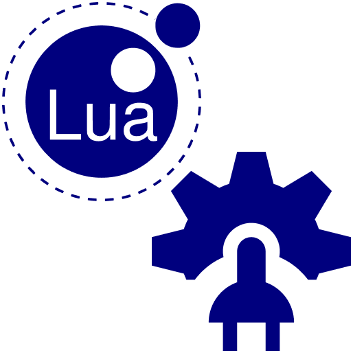

# Godot Lua PluginScript



GDNative + PluginScript library that adds support for [Lua](https://www.lua.org/)
as a scripting language in [Godot](https://godotengine.org/).

Being a GDNative library, recompiling the engine is not required, so anyone
with a built release copied to their project can use it.
Being a PluginScript language, Lua can seamlessly communicate with scripts
written in GDScript / C# / Visual Script and vice-versa.
This way, one can use the language that best suits the implementation for each
script and all of them can understand each other.

This plugin is available in the Asset Library as [Lua PluginScript](https://godotengine.org/asset-library/asset/1078)
and has [online documentation](https://gilzoide.github.io/godot-lua-pluginscript/topics/README.md.html).

For some usage examples, check out [lps\_coroutine.lua](lps_coroutine.lua)
and [plugin/lua\_repl.lua](plugin/lua_repl.lua).

Currently, only LuaJIT is supported, since the implementation is based on its
[FFI](https://luajit.org/ext_ffi.html) library.


## Installing

Either:

- In Godot Editor, open the [Asset Library tab](https://docs.godotengine.org/en/stable/tutorials/assetlib/using_assetlib.html#in-the-editor),
  search for the [Lua PluginScript](https://godotengine.org/asset-library/asset/1078)
  asset, download and install it.
- Put a built release of the library into the project folder and restart Godot.
  Make sure the `lua_pluginscript.gdnlib` file is located at the
  `res://addons/godot-lua-pluginscript` folder.
- Clone this repository as the project's `res://addons/godot-lua-pluginscript`
  folder and build for the desired platforms.


## Project Settings + Plugin

In the `Project -> Project Settings...` window, some settings are available:

- **Lua PluginScript/Package Path/Behavior**: Whether templates will replace
  [package.path](https://www.lua.org/manual/5.1/manual.html#pdf-package.path),
  be appended to it or prepended to it.
  Default behavior: replace.
- **Lua PluginScript/Package Path/Templates**: String array of templates to be
  injected into `package.path`.
  Default templates: `res://?.lua` and `res://?/init.lua`.
- **Lua PluginScript/Package C Path/Behavior**: Whether templates will replace
  [package.cpath](https://www.lua.org/manual/5.1/manual.html#pdf-package.cpath),
  be appended to it or prepended to it.
  Default behavior: replace.
- **Lua PluginScript/Package C Path/Templates**: String array of templates to be
  injected into `package.cpath`.
  Default templates: `!/?.dll` and `!/loadall.dll` on Windows, `!/?.so` and `!/loadall.so` elsewhere.

Also, an editor plugin is included, currently with a barebones REPL for Lua
expressions, located in the bottom panel of the editor.
Enable the `Lua PluginScript` plugin in the `Plugins` tab of the Project Settings window.


## Using LuaRocks

Lua modules available at [LuaRocks](https://luarocks.org/) can be installed locally to the project:

```
luarocks install --lua-version 5.1 --tree <local modules folder name> <module name>
```

Adjust the package paths using the settings described above and Lua PluginScript
should be able to `require` the installed modules.


## Goals

- Provide support for Lua as a scripting language in Godot in a way that does
  not require compiling the engine from scratch
- Be able to seamlessly communicate with any other language supported by Godot,
  like GDScript, Visual Script and C#, in an idiomatic way
- Simple script description interface that doesn't need `require`ing anything
- Support for LuaJIT and Lua 5.2+
- Support paths relative to `res://*` and exported game/app executable path for
  `require`ing Lua modules
- Have a simple build process, where anyone with the cloned source code and
  installed build system + toolchain can build the project in a single step


## Non-goals

- Provide calls to all core Godot classes' methods via native method bindings
- Support multithreading on the Lua side


## Articles

1. [Designing Godot Lua PluginScript](https://github.com/gilzoide/godot-lua-pluginscript/blob/main/blog/1-design-en.md)
2. [Implementing the library's skeleton](https://github.com/gilzoide/godot-lua-pluginscript/blob/main/blog/2-infrastructure-en.md)
3. [Integrating LuaJIT and FFI](https://github.com/gilzoide/godot-lua-pluginscript/blob/main/blog/3-luajit-callbacks-en.md)
4. Initializing and finalizing scripts (TODO)


## Script example

This is an example of how a Lua script looks like.

```lua
-- Class definitions are regular Lua tables, to be returned from the script
local MyClass = {}

-- Optional: set class as tool, defaults to false
MyClass.is_tool = true

-- Optional: set base class by name, defaults to 'Reference'
MyClass.extends = 'Node'

-- Optional: give your class a name
MyClass.class_name = 'MyClass'

-- Declare signals
MyClass.something_happened = signal()
MyClass.something_happened_with_args = signal("arg1", "arg2")

-- Values defined in table are registered as properties of the class
MyClass.some_prop = 42

-- The `property` function adds metadata to defined properties,
-- like setter and getter functions
MyClass.some_prop_with_details = property {
  -- ["default_value"] or ["default"] or [1] = property default value
  5,
  -- ["type"] or [2] = variant type, optional, inferred from default value
  -- All Godot variant type names are defined globally as written in
  -- GDScript, like bool, int, float, String, Array, Vector2, etc...
  -- Notice that Lua <= 5.2 does not differentiate integers from float
  -- numbers, so we should always specify `int` where appropriate
  -- or use `int(5)` in the default value instead
  type = int,
  -- ["get"] or ["getter"] = getter function or method name, optional
  get = function(self)
    return self.some_prop_with_details
  end,
  -- ["set"] or ["setter"] = setter function or method name, optional
  set = 'set_some_prop_with_details',
  -- ["usage"] = property usage, from `enum godot_property_usage_flags`
  -- optional, default to `PropertyUsage.DEFAULT`
  usage = PropertyUsage.DEFAULT,
  -- ["hint"] = property hint, from `enum godot_property_hint`
  -- optional, default to `PropertyHint.NONE`
  hint = PropertyHint.RANGE,
  -- ["hint_string"] = property hint text, only required for some hints
  hint_string = '1,10',
  -- ["rset_mode"] = property remote set mode, from `enum godot_method_rpc_mode`
  -- optional, default to `RPCMode.DISABLED`
  rset_mode = RPCMode.MASTER,
}

-- Functions defined in table are public methods
function MyClass:_ready()  -- `function t:f(...)` is an alias for `function t.f(self, ...)`
  -- Singletons are available globally
  local os_name = OS:get_name()
  print("MyClass instance is ready! Running on a " .. os_name .. " system")
end

function MyClass:set_some_prop_with_details(value)
    self.some_prop_with_details = value
    -- Indexing `self` with keys undefined in script will search base
    -- class for methods and properties
    self:emit_signal("something_happened_with_args", "some_prop_with_details", value)
end

function MyClass:get_some_prop_doubled()
  return self.some_prop * 2
end

-- In the end, table with class declaration must be returned from script
return MyClass
```


## Status

- [X] LuaJIT support
- [ ] Lua 5.2+ support
- [X] Useful definitions for all GDNative objects, with methods and metamethods
- [X] A `yield` function similar to GDScript's, to resume after a signal is
  emitted (`GD.yield`)
- [X] Working PluginScript language definition
- [X] PluginScript script validation and template source code
- [ ] PluginScript code editor callbacks
- [ ] PluginScript debug callbacks
- [ ] PluginScript profiling callbacks
- [X] Package searcher for Lua and C modules that work with paths relative to
  the `res://` folder and/or exported games' executable path
- [X] Lua REPL
- [X] API documentation
- [ ] Unit tests
- [ ] Example projects
- [ ] Export plugin to minify Lua scripts
- [X] Drop-in binary release in GitHub
- [X] Submit to Asset Library


## Documentation
The API is documented using [LDoc](https://stevedonovan.github.io/ldoc/manual/doc.md.html).
Documentation may be generated with the following command:

    # make docs


## Building

This project uses git submodules for its dependencies, so be sure to activate
submodules before building.

```sh
# clone this repository and activate submodules in a single command
git clone --recurse-submodules https://github.com/gilzoide/godot-lua-pluginscript.git

# or clone it normally and then activate submodules
git clone https://github.com/gilzoide/godot-lua-pluginscript.git
cd godot-lua-pluginscript
git submodule init
git submodule update
```

Build using [make](https://www.gnu.org/software/make/) from project root,
specifying the system as target:

```sh
# Choose one of the supported platforms, based on your operating system
make windows64  # x86_64
make windows32  # x86
make linux64    # x86_64
make linux32    # x86
make osx64 \    # "universal" multiarch x86_64 + amd64 dylib
    MACOSX_DEPLOYMENT_TARGET=XX.YY
make android-armv7a \   # Android ARMv7
    NDK_TOOLCHAIN_BIN=/path/to/ndk/toolchains/llvm/prebuild/host_os-arch/bin   
make android-aarch64 \  # Android ARM64
    NDK_TOOLCHAIN_BIN=/path/to/ndk/toolchains/llvm/prebuild/host_os-arch/bin  
make android-x86 \      # Android x86
    NDK_TOOLCHAIN_BIN=/path/to/ndk/toolchains/llvm/prebuild/host_os-arch/bin      
make android-x86_64 \   # Android x86_64
    NDK_TOOLCHAIN_BIN=/path/to/ndk/toolchains/llvm/prebuild/host_os-arch/bin   
```

The GDNativeLibrary file `lua_pluginscript.gdnlib` is already configured to use
the built files stored in the `build` folder, so that one can use this
repository directly inside a Godot project under the folder
`addons/godot-lua-pluginscript`.


## Third-party software

This project uses the following software:

- [godot-headers](https://github.com/godotengine/godot-headers): headers for
  GDNative, released under the MIT license
- [LuaJIT](https://luajit.org/luajit.html): Just-In-Time Compiler (JIT) for the
  Lua programming language, released under the MIT license
- [High Level GDNative (HGDN)](https://github.com/gilzoide/high-level-gdnative):
  higher level GDNative API header, released to the Public Domain


## Other projects for using Lua in Godot

- https://github.com/perbone/luascript
- https://github.com/Trey2k/lua
- https://github.com/zozer/godot-lua-module
