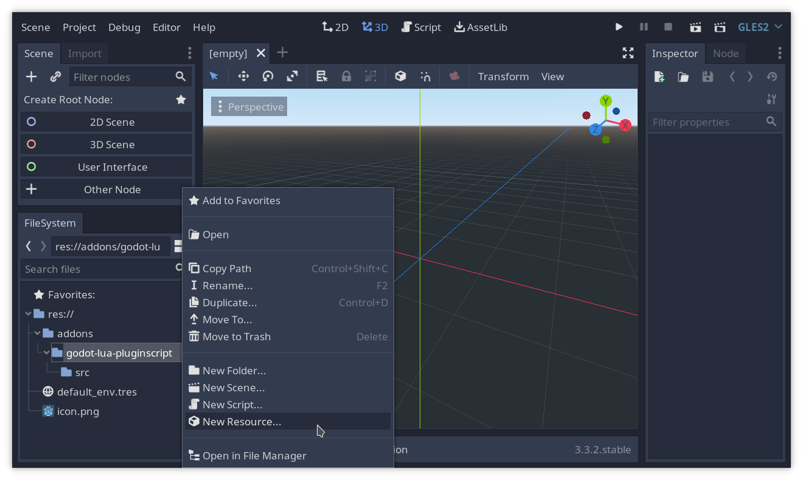
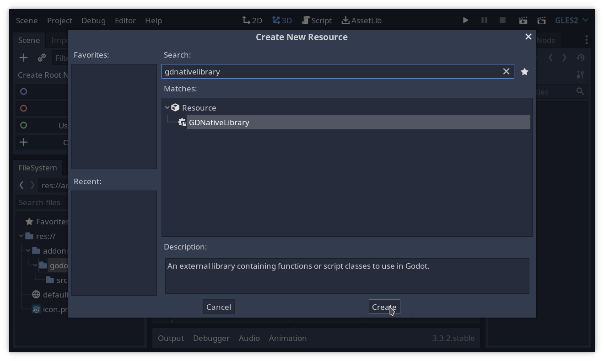
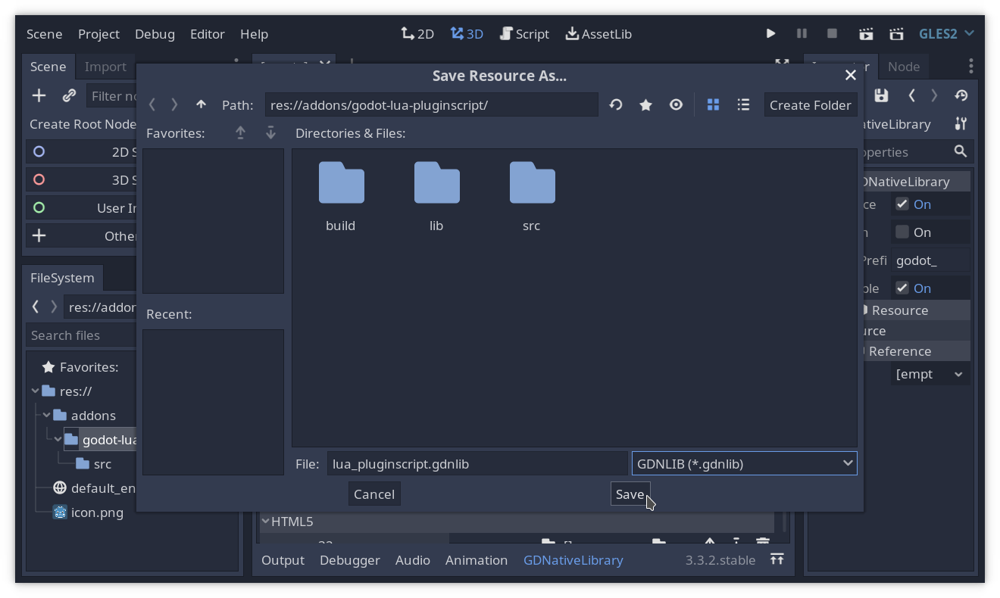
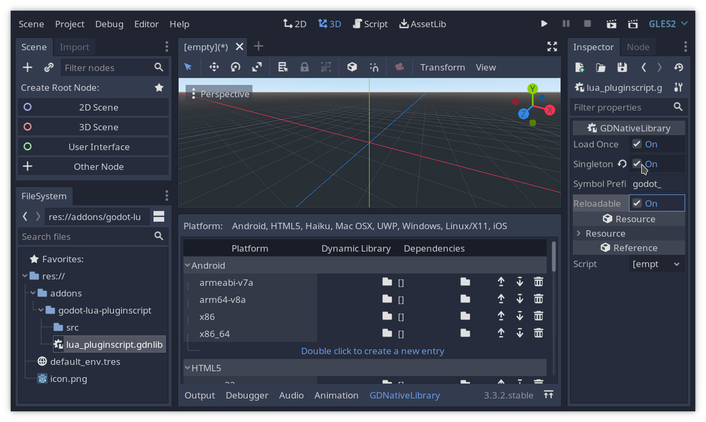
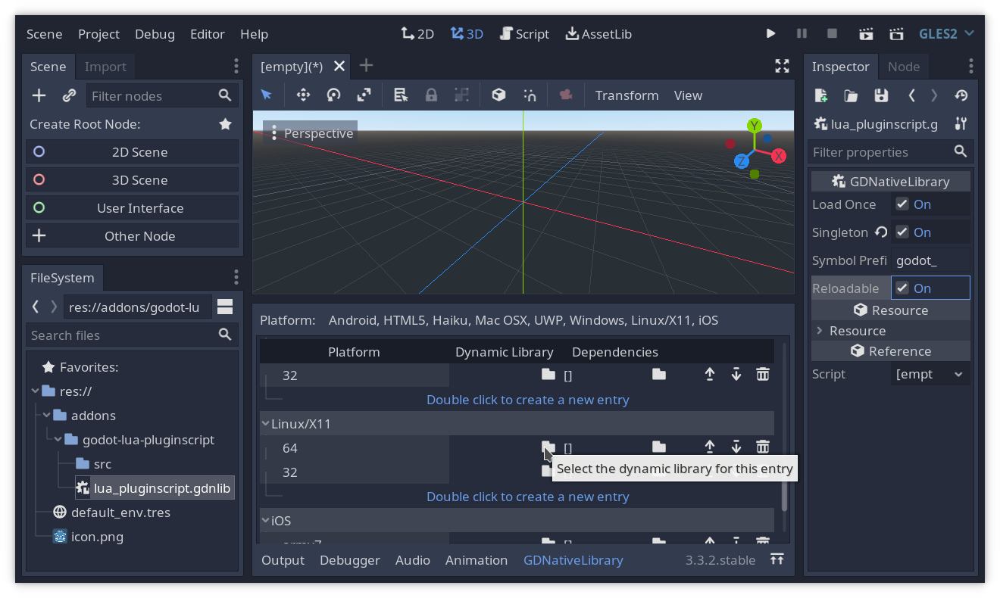
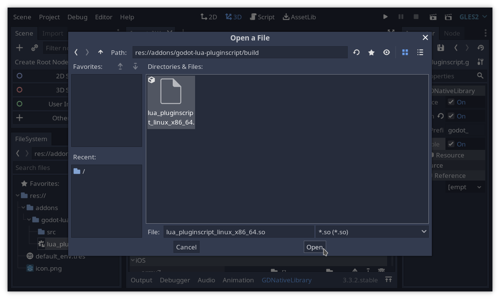

# Implementing the infrastructure of a GDNative + PluginScript module
2021-08-03 | `#Godot #Lua #LuaJIT #GDNative #PluginScript #C` | [*Versão em Português*](2-infrastructure-pt.md)

In the [last post we talked about the design of a plugin for using Lua as a scripting language in Godot](1-design-en.md).
Today we'll start implementing our plugin with the barebones
infrastructure: a [GDNative](https://godotengine.org/article/look-gdnative-architecture)
library that registers [Lua](https://www.lua.org/) as a scripting
language for the [Godot game engine](https://godotengine.org/).
The scripting runtime won't work for now, but Godot will correctly load
our library and import `.lua` files.


## How to GDNative
Let's start building an empty GDNative library.
These are shared libraries (DLLs) that are loaded at runtime by the
engine.
They must declare and export the functions `godot_gdnative_init` and
`godot_gdnative_terminate`, to be called when the module is initialized
and terminated, respectively.

GDNative libraries are loaded only when needed by the project, unless
they are marked as [singletons](https://docs.godotengine.org/en/stable/classes/class_gdnativelibrary.html#class-gdnativelibrary-property-singleton).
Since we want ours to be loaded at project startup, so that Lua scripts
can be imported, we'll make it a singleton.
For this, we also need to declare a function called
`godot_gdnative_singleton`, or Godot won't load our library.
The downside of using singleton GDNative libraries is that they are
never reloaded, so we'll have to reopen the editor each time we
recompile it.

Ok, time to start this up!
First of all, let's download the [GDNative C API repository](https://github.com/godotengine/godot-headers.git lib/godot-headers).
Since I'm using [Git](https://git-scm.com/) for the project, I'll add it
as a submodule.
I'm using the `lib` directory for maintaining all third-party libraries
at the same place.

```sh
git submodule add https://github.com/godotengine/godot-headers.git lib/godot-headers
```

The GDNative API is very low-level, so I'll also be using my own
[High Level GDNative C/C++ API (HGDN)](https://github.com/gilzoide/high-level-gdnative):

```sh
git submodule add https://github.com/gilzoide/high-level-gdnative.git lib/high-level-gdnative
```

We'll be storing our source files in the `src` folder, for organization.
Here is the skeleton for our GDNative module source, in C:

```c
/// src/language_gdnative.c

// HGDN already includes godot-headers
#include "hgdn.h"

// GDN_EXPORT makes sure our symbols are exported in the way Godot expects
// This is not needed, since symbols are exported by default, but it
// doesn't hurt being explicit about it
GDN_EXPORT void godot_gdnative_init(godot_gdnative_init_options *options) {
	hgdn_gdnative_init(options);
}

GDN_EXPORT void godot_gdnative_terminate(godot_gdnative_terminate_options *options) {
	hgdn_gdnative_terminate(options);
}

GDN_EXPORT void godot_gdnative_singleton() {
}
```

Since HGDN is a header-only library, we need a C or C++ file for the
implementation. We could use `src/language_gdnative.c` for this, but
I'll add a new file for it to avoid recompiling HGDN implementation on
future builds:

```c
// src/hgdn.c
#define HGDN_IMPLEMENTATION
#include "hgdn.h"
```

Time to build!
I'll be using [xmake](https://xmake.io) as build system, because it
supports several platforms, as well as cross-compiling, out of the box.
Also, it has a nice package system integrated that we'll use for
embedding Lua/LuaJIT later.
The `xmake.lua` build script is as follows:

```lua
-- xmake.lua
target("lua_pluginscript")
	set_kind("shared")
	-- Set the output name to something easy to find like `build/lua_pluginscript_linux_x86_64.so`
	set_targetdir("$(buildir)")
	set_prefixname("")
	set_suffixname("_$(os)_$(arch)")
	-- Add "-I" flags for locating HGDN and godot-header files
	add_includedirs("lib/godot-headers", "lib/high-level-gdnative")
	-- src/hgdn.c, src/language_gdnative.c
	add_files("src/*.c")
target_end()
```

Run `xmake` and, if all goes well, we should have a `.so` or `.dll` or
`.dylib` shared library in the `build` folder.

Time to open Godot.
I've created a new project and added our module repository at
`addons/godot-lua-pluginscript`.
Now we need to create a new GDNativeLibrary Resource:







Set it as singleton:



And set the library path:




Restart the editor and our module should be imported, nice!


<!--As a side note, since interfacing with C using LuaJIT's FFI is substantially-->
<!--easier than with the Lua/C API and most people will likely want to use-->
<!--it for the increased speed, LuaJIT support will be implemented first.-->
<!--Using [cffi-lua](https://github.com/q66/cffi-lua) and similar modules-->
<!--may make this first implementation portable to vanilla Lua as well.-->

