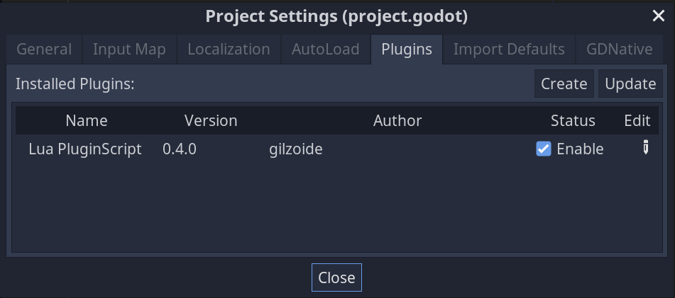
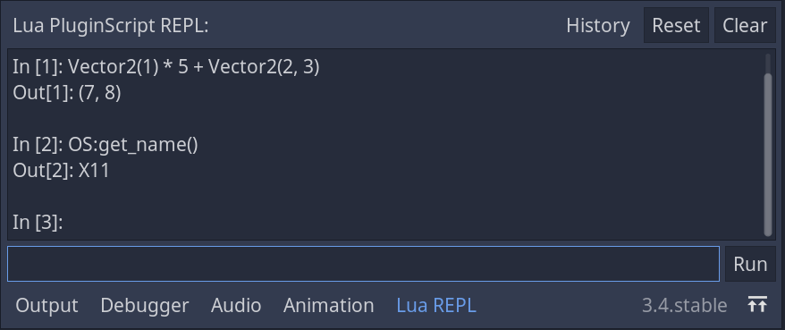

# Editor Plugin

Lua PluginScript comes with an editor plugin that has an interactive Lua
console and an export plugin that minifies Lua scripts.

## Enabling

The plugin can be enabled in the project's `Project -> Project Settings...`
window, in the `Plugins` tab:

## REPL

An interactive Lua console is available on the bottom panel, for testing Lua
expressions.
It comes with a basic input history, so that pressing the up/down arrows move
between already given inputs.
Just like Lua/LuaJIT's interactive interpreter, `local` variables do not
persist between expressions, so they should be declared globally if you want to
use their value in a next expression.

## Minify on release export

If the [**Lua PluginScript/Export/Minify On Release Export**](Configuring.md)
setting is enabled, Lua scripts will get minified when exporting a release
version of the game/application.
Minification uses [LuaSrcDiet](https://github.com/jirutka/luasrcdiet) and its
[maximum settings](https://github.com/jirutka/luasrcdiet/blob/master/doc/features-and-usage.adoc#features).

Notice that minification messes with the scritps' line numbers and consequently
with stack traces.
That is why minification is not available for debug builds.
